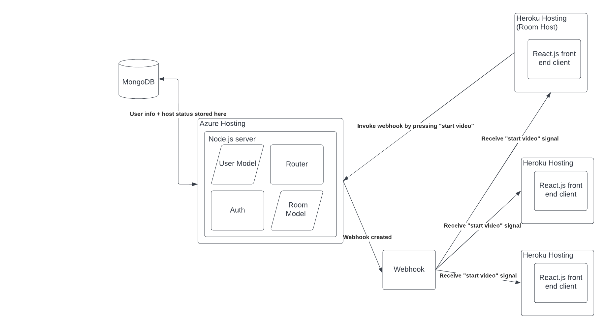
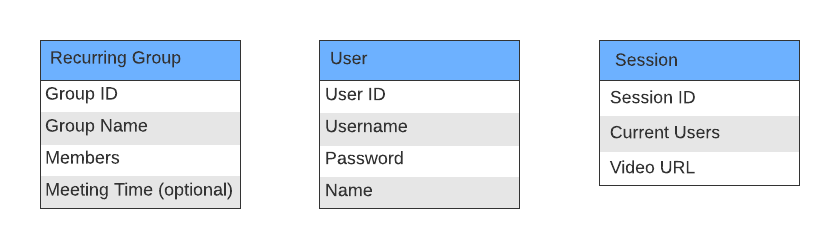

# Video Watch Together
[Frontend Site](https://ancient-scrubland-86582.herokuapp.com/)

## Project Desc
Our target audience would be anyone who wants to be able to watch things with other people but due to their schedule, or other factors, they are not able to meet with them in person. So we still want to give them the experience of watching something together simultaneously without going through the stress and annoyances that come with having to plan a meet up. With the current state of the world, it is not as easy as it once was to be able to meet in person without any worries, but even so people still want to be able to hang out with family and friends. Our application will be able to fill one part of that aspect by allowing people to watch things together.

In terms of the actual demographic we are targeting, it can be anyone with busy schedules such as students or people with a busy career, or just anyone that wants to be able to watch something with someone that cannot meet with them in person, such as a family or friend that lives far away from you.

We as developers want to build this application because we are also part of the audience we are targeting, so we understand the struggles and have been through what we are wanting to solve as well. So by building this we can solve our problems while helping others too.

## Architectural Diagram

### Database Schema

## Summary Table of User Stories

| #  | Priority | User              | Description                                                                                                                                           | Technical Implementation                                                                                                                                                                                                                                                                                                                                                                                                           |
|----|----------|-------------------|-------------------------------------------------------------------------------------------------------------------------------------------------------|------------------------------------------------------------------------------------------------------------------------------------------------------------------------------------------------------------------------------------------------------------------------------------------------------------------------------------------------------------------------------------------------------------------------------------|
| 1  | p0       | As a college kid… | I want to bring all my friends together to watch my favorite youtube documentary.                                                                     | The host will input the video link and participant emails. When the information is submitted, the client will send a POST request to our /class end point and render a new group on the webpage associated with the host account. We will then generate a link to the event that will be sent out through an automated email. We will use the  module Nodemailer to complete this task.                                            |
| 2  | p0       | As a college kid… | I want to join all my friends to watch a youtube documentary that was recommended by a friend.                                                        | The participant will access the email and click on the button to join the event. Once the partcipant receives the “start video” signal, a GET request will be sent and they will be taken to the youtube video. We will add an extra page to the UI acting as a “waiting room”                                                                                                                                                     |
| 3  | p0       | As a teacher…     | I want to host an extra credit activity where my students can watch a youtube video together about a topic relevant to the class.                     | Same as #1                                                                                                                                                                                                                                                                                                                                                                                                                         |
| 4  | p0       | As a student…     | I want to join a youtube activity hosted by my teacher in order to get extra credit for my class.                                                     | Same as #2                                                                                                                                                                                                                                                                                                                                                                                                                         |
| 5  | p0       | As a grandmother… | I want to bring my family together to watch my granddaughter’s recorded piano recital.                                                                | Same as #1                                                                                                                                                                                                                                                                                                                                                                                                                         |
| 6  | p0       | As a hoster…      | I want to start the video                                                                                                                             | We launch the start of the video on the host’s screen as well as the participants’ screens. We will complete thisis task by invoking a webhook by pressing the “start video” button. The participant’s will receive the “start video” signal.                                                                                                                                                                                      |
| 7  | p0       | As a hoster…      | I want to create an account in order to create an event and invite other users to join.                                                               | We will create create account / login functionality in the UI using React.js. We will utilize azure authentication to enable users to login / create microsoft accounts. We will utilize “/signin”, “/signout”, and “/unauthorized” endpoints to login thorough UW Mircosoft account. After creating / logging in, the user will be prompted to the page where they will be able to invite participants and specify a youtube URL. |
| 8  | p0       | As a hoster…      | I want to login to my account in order to create an event and invite others to join the event or invite a previously created group to join the event. | Same as #7                                                                                                                                                                                                                                                                                                                                                                                                                         |
| 9  | p1       | As a hoster…      | I want to be able to create a recurring group to watch something every week or periodically. Similar to recurring zoom meetings.                      | We will use Mongodb to save recurring events that can allow for certain users to join based on who’s been added to the group.                                                                                                                                                                                                                                                                                                      |
| 10 | p1       | As a hoster…      | I want to be able to quickly invite my friend group to the youtube videos I want to watch quickly and efficiently.                                    | We will utilize our Mongodb to access saved groups based on login information using a GET request.                                                                                                                                                                                                                                                                                                                                 |
| 11 | p2       | As a user…        | I want to be able to discuss the video with my friends without interupting the youtube video.                                                         | We will complete this task by creating a discussion forum for users hosting or invited to the event. We will store posts and replies in memory since the forum will only be meant for single events and will not need to be stored over time. We will also add UI to add comments to the discussion.                                                                                                                               |
| 12 | p3       | As a user…        | I want to share the event with other friends on social media.                                                                                         | We will create a function to share to twitter, instagram, and/or facebook and implement the function within the html. We will design a poster using meta data of the video to promote the website. We will add a button within the event UI to “share”, provide a preview of the share, and utilize a redirect endpoint to take the user to thee specified social media post page.                                                 |

## Endpoints + Desc

There are two main backend sections that have to be calculated. The first part is on initial video session creation. This section has to be able to obtain information such as user data as well as the youtube link to search.

- POST /session
    - BODY
        - User Information
        - Youtube Link
    - PROCESS
        - Creates/Authenticates User Information
        - Fetches Youtube Embed Information
        - Creates WebSocket for session creator
    - RETURNS
        - WebSocket
        - Embed Code

The second part is a getter endpoint that creates a socket for the new user, forms the connection, and sends the youtube embed to the client in order to create the server. 

- GET /session/{session-id}
    - PATH PARAM
Session-id
    - PROCESS
        - Locates session information
        - Adds socket to the list of connected sockets
    - RESPONSE
        - Youtube Link/Embed
        - WebSocket

We will also include endpoints to get both user data for a single user and the users within a session or group

- GET /user/{user-id}
    - PATH PARAM
        - user-id
    - PROCESS
        - Locates user within database
    - RESPONSE
        - JSON containing user data

- GET /group/{group-id}
    - PATH PARAM
        - group-id
    - PROCESS
        - Locates users, name and other relevant information pertaining to a single recurring group
    - RESPONSE
        - JSON containing information about group
        - List of users
        - Name
        - Time