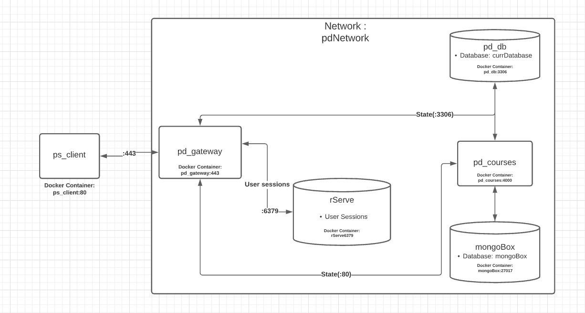

# Productivity Space

## Project Description

For many people, it’s difficult to quantify concrete measures of time or effort spent on single tasks, or categories of tasks. This makes it harder for people to understand how productively they are using their time, or how they split up time overall. Therefore, in order to address this situation, we have chosen to build Productivity Space, a website focused on helping people better quantify their work, and overall time spent. This website will have task categories that users can choose, as well as tasks that they can add to indicate what they are working on. This website is built mostly for students, as they often need to juggle many different things, like classes and assignments, in a limited period of time. By providing a website that compartmentalizes things that need to be done, we believe that this will give students a better understanding of where their time goes, and help them more easily reflect on, and possibly change the way they divide up task time.

As developers, we want to build this application because we believe that a website like this can genuinely be of use to people, and be a valuable resource in helping them better understand their own productivity

## Technical Description

### Architectural Diagram

[Lucid Chart Diagram](https://lucid.app/lucidchart/invitations/accept/inv_9125821a-272b-4267-9ba3-0d19b99f7370?viewport_loc=-11%2C89%2C1579%2C735%2C0_0)

### User Stories
|Priority|User|Description|
|---|---|---|
|P0|As a user|I want to categorize my tasks into different task lists. To categorize tasks into different tasks lists, we will create a form using React.js. When submitted, the client will send a POST request to our /class end point and render a new category on the webpage.|
|P0|As a user|I want to time how long it takes to complete specific tasks on my task list. To time how long it takes to complete a task, we will build a timer component using React.js. We will store time as an Integer in the state of our component, and will send a PATCH request to our /assignment/{assignmentID} end point when the timer is stopped.|
|P0|As a user|I want to be able to mark tasks as completed when I am finished with them. To update the status of tasks, we will create a checkbox and a submit button using React.js. When the submit button is clicked, the client will send a PATCH request to our /assignment/{assignmentID} end point with the current state of the checkbox in its request body.|
|P0|As a user|I want to securely login to Productivity Space so that my tasks can only be accessed by me. To handle a login to the web app, we will create a login page using React.js. When a user submits an email and password, the client will send a POST request to our /user endpoint, and handle user sign in. After, the user will be moved to the task list page.|
|P0|As a user|I want to sign up for the Productivity Space if I do not already have an account. To handle user signup to the web app, we will create a sign up page using React.js. When a user submits an email and password, the client will send a POST request to our /user endpoint, and handle user sign up. After, the user will be moved to the task list page.|
|P0|As a dev|I want user data to be accessed separately to prevent any breaches in privacy. To ensure that user data will be accessed separately, we will require an email and password when logging into the client. We will use this information to authenticate the user and ensure that their data cannot be accessed by others.|
|P1|As a user|I want to see a visualization of the total amount of time it took me to complete tasks in a category. To handle data visualizations in our web app, we will use a React.js library to render task data. Task data will be obtained by sending a  GET request to our /class/{classID} end point.|

###  Endpoints
- /newuser
    - POST: Sign Up
- user
    - POST: Sign In
- /user/
    - DELETE: Sign Out
- /assignment
    - GET: Gets a list of all the assignments
    - POST: Add an assignment
- /assignment/{assignmentID}
    - PATCH: Update assignment data ie completeness and time spent
    - DELETE: Deletes assignment
- /class
    - GET: Gets a list of all the classes
    - POST: Add a class
- /class/{classID}
    - GET: Gets a list of all assignments in a class
    - DELETE: Deletes a class

### Addendum
Updated architectural diagram :

[Lucid Chart Diagram](https://lucid.app/lucidchart/invitations/accept/inv_9125821a-272b-4267-9ba3-0d19b99f7370?viewport_loc=-11%2C89%2C1579%2C735%2C0_0)
